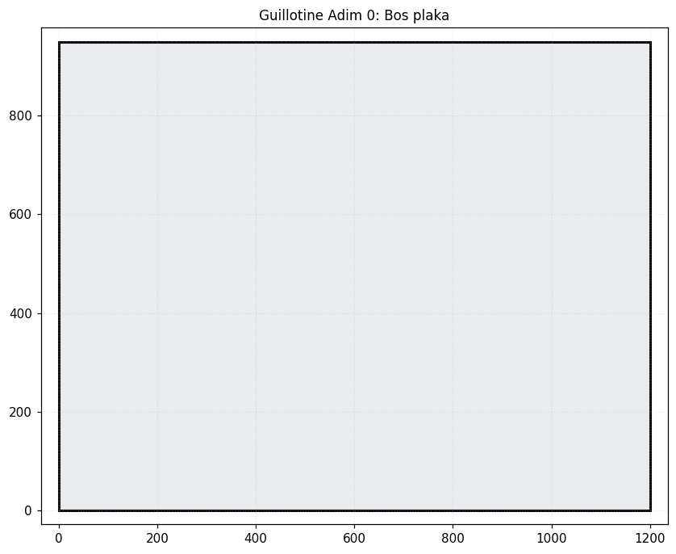
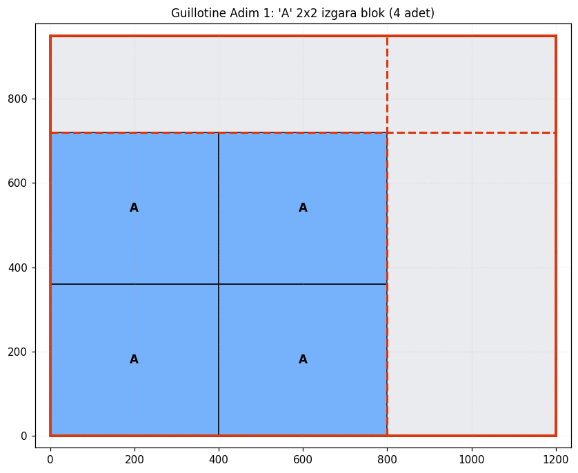
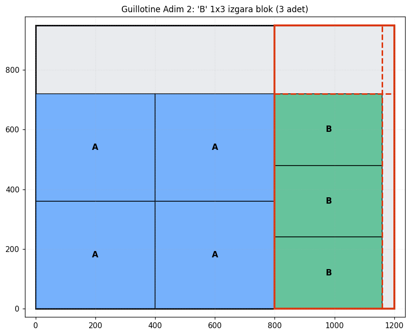
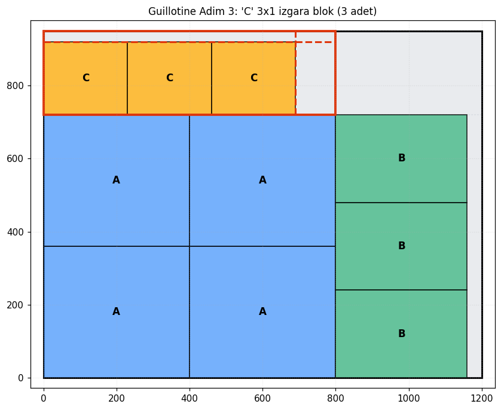
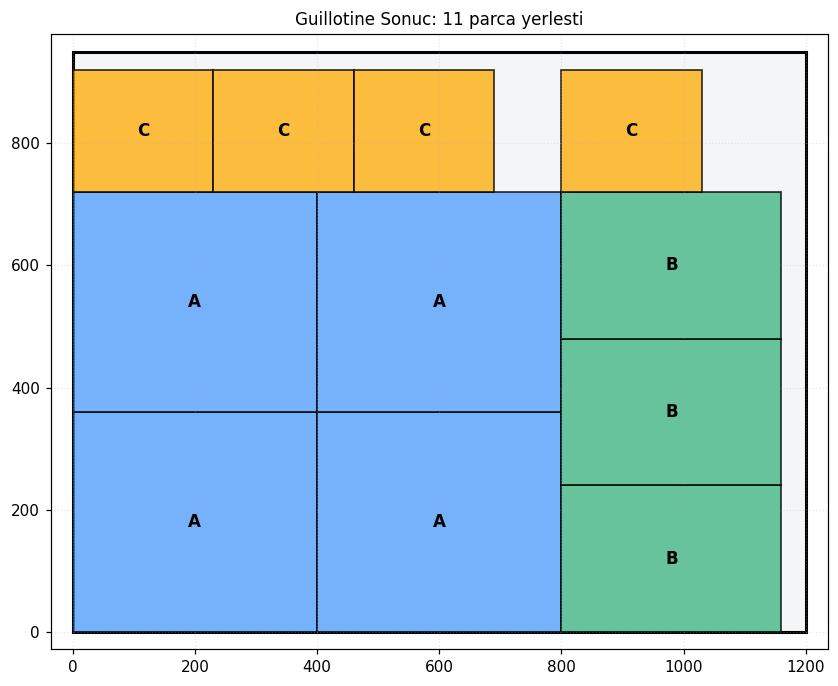

# Optimizasyon Nasil Calisir? — Adim Adim Ornek

Bu dokuman, cam kesim optimizasyonunun nasil calistigini **basit bir
ornek** uzerinden hem adim adim hem de gorsel olarak anlatir.

Buradaki tum gorseller, **uretim cozucusunun birebir ayni mantigi** ile
uretilmistir:

```bash
python examples/guillotine_demo.py   # guillotine (varsayilan) gorselleri
python examples/step_by_step_demo.py # MaxRects (alternatif) gorselleri
```

---

## 1. Problem ve Kritik Kisit: Guillotine Kesim

Elimizde bir ham cam plakasi ve kesilmesi gereken parcalar var. Amac:
parcalari plakaya oyle yerlestirmek ki **fire (atik) en az** olsun.

Ancak cam icin kritik bir kisit vardir:

> **Cam kesim koprusu DUZ (edge-to-edge) kesim yapar.** Bicak plakayi bir
> kenardan diger kenara kadar boler — yarida durup yon degistiremez.
> Bu yuzden yerlesim **guillotine kesilebilir** olmak ZORUNDADIR:
> once bir yonde bastan basa kesim, sonra olusan seritlerde ara kesimler.

Yani bu, klasik (serbest) 2D bin-packing **degildir**; **guillotine-kisitli
2D cutting-stock** problemidir. Asagidaki iki yerlesimi karsilastirin:

```
  GECERLI (guillotine)          GECERSIZ (serbest paketleme)
  +--------+------+             +--------+------+
  |  A     |  B   |             |  A     |  B   |
  +--------+------+             +----+---+------+
  |  C     |  D   |             | C  |   D      |    <-- D'yi kesmek icin
  +--------+------+             +----+----------+        bicak ortada
                                                         donmek zorunda
  Her kesim bastan basa.        Bu duzen koprude kesilemez.
```

Ek olarak, atolye verimliligi icin bir plakadaki **parca cesitliligi**
de az olmalidir: ayni plakada ne kadar az farkli olcu olursa kurulum ve
kesim o kadar kolaydir.

---

## 2. Katmanli Veri Akisi

```
  JSON girdi
      |
      v
 [ data ]      ----> dogrula (validators)
      |
      v
 [ domain ]    ----> StockSheet, PartOrder modelleri
      |
      v
 [ optimization ] -> GUILLOTINE homojen-blok paketleme (varsayilan)
      |
      v
 [ services ]  ----> maliyet, fire, kesim plani
      |
      v
 [ presentation ] -> konsol raporu + PNG gorsel
```

---

## 3. Guillotine Homojen-Blok Paketleme — Adim Adim

Cozucu, plakayi ozyinemeli olarak doldurur. **Her bolgeye once TEK bir
parca olcusunden olabildigince cok parcayi izgara (grid) seklinde**
yerlestirir; sonra kalan guillotine artiklarina sonraki olculeri
doldurur.

Ornek: **1200 x 950 mm** plaka, uc farkli parca (A: 400x360, B: 360x240,
C: 230x200).

### Adim 0 — Bos plaka



### Adim 1 — En cok dolduran olcu (A) izgara blok olarak yerlesir

Cozucu, plakayi en cok dolduran tek-tip blogu arar. Burada A (400x360),
**2x2 izgara** (4 adet) ile en buyuk dolu alani verir. Kirmizi kesikli
cizgiler **guillotine kesimleridir**: blogun sagindan dikey, ustunden
yatay tam kesim. Blok bir izgara oldugu icin once sutunlara, sonra
satirlara kesilir — hepsi edge-to-edge.



### Adim 2-4 — Kalan seritler sonraki olculerle dolar

Geriye kalan **sag serit** ve **ust serit** birer dikdortgendir ve
ozyinemeli olarak ayni mantikla doldurulur:
- Sag seride B (360x240) bir sutun (3 adet) halinde,
- Ust seride C (230x200) bir satir (4 adet) halinde yerlesir.

Her yeni blok yine tek tiptir (homojen) ve guillotine kesilebilir.





### Sonuc



Dikkat edin: her renk (parca tipi) **kendi dikdortgen blogunda**
toplandi (dusuk cesitlilik) ve tum sinirlar bastan basa duz cizgiler
(guillotine). Iste bu, kesim koprusunde dogrudan kesilebilen bir plandir.

> **Neden serbest paketleme degil?** MaxRects gibi yontemler birkac puan
> daha yuksek doluluk verebilir; ama urettikleri yerlesim koprude
> kesilemeyebilir. Cam icin **gecerli kesim > birkac puan doluluk**.

---

## 4. Alternatif Stratejiler

Guillotine zorunlu olmayan kesim yontemleri (su jeti, lazer) icin paket
baska cozuculer de sunar:

| Strateji | Algoritma | Guillotine? | Kullanim |
|---|---|---|---|
| `guillotine` | Recursive homojen-blok | **Evet** | **Cam koprusu (varsayilan)** |
| `maxrects` | Best Short Side Fit | Hayir | Su jeti / lazer, en hizli |
| `cpsat` | OR-Tools NoOverlap2D | Hayir | Kucuk problem / referans |
| `hybrid` | MaxRects + CP-SAT polish | Hayir | Serbest kesimde en yuksek doluluk |

`maxrects` ve `hybrid`'in nasil calistigi (serbest paketleme, bos
dikdortgen bolme) icin `examples/step_by_step_demo.py` gorsellerine
bakabilirsiniz.

Strateji secimi:

```bash
./run.sh examples/sample_input.json output 5            # guillotine (varsayilan)
./run.sh examples/sample_input.json output 5 --strategy maxrects
```

---

## 5. Ciktilar

Optimizasyon bitince uretilenler:

- **Konsol raporu**: verim, maliyet, plaka basina ozet (rich tablolari)
- **`output/report.txt`**: operator icin sirali kesim talimatlari
- **`output/sheet_*.png`**: her plakanin renk kodlu yerlesim gorseli
- **Fire analizi**: yeniden kullanilabilir buyuk parcalarin (offcut)
  konum ve olculeri

---

## Ozet

1. Cam kesim koprusu duz kestigi icin yerlesim **guillotine** olmali.
2. **Guillotine cozucu** her bolgeye once tek olcuden izgara blok koyar
   (dusuk fire + dusuk cesitlilik), kalan artiklara ozyinele.
3. Tum kesimler bastan basa (edge-to-edge) oldugu icin plan koprude
   dogrudan uygulanabilir.
4. Sonuc; rapor, kesim plani ve gorsel olarak sunulur.

Daha fazla detay icin ana [README](../README.md) dosyasina bakin.
