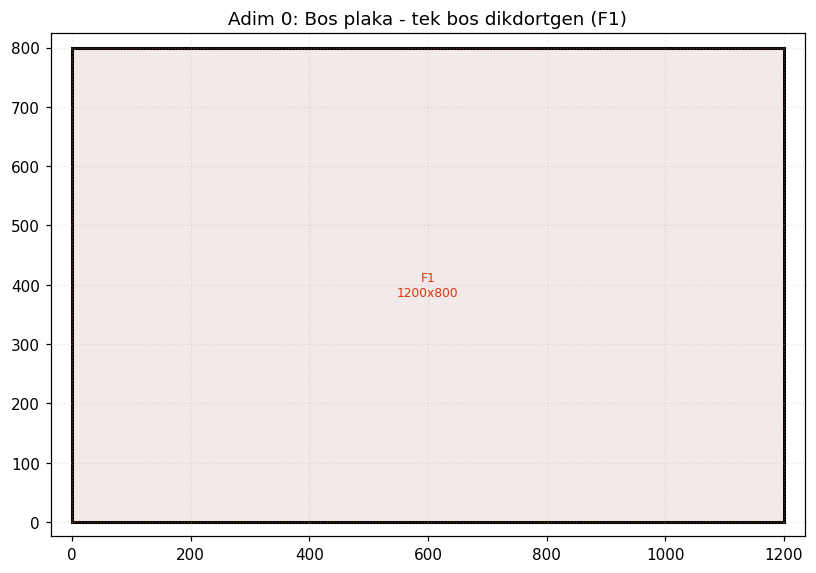
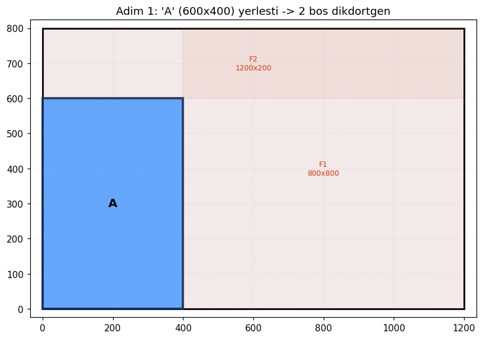
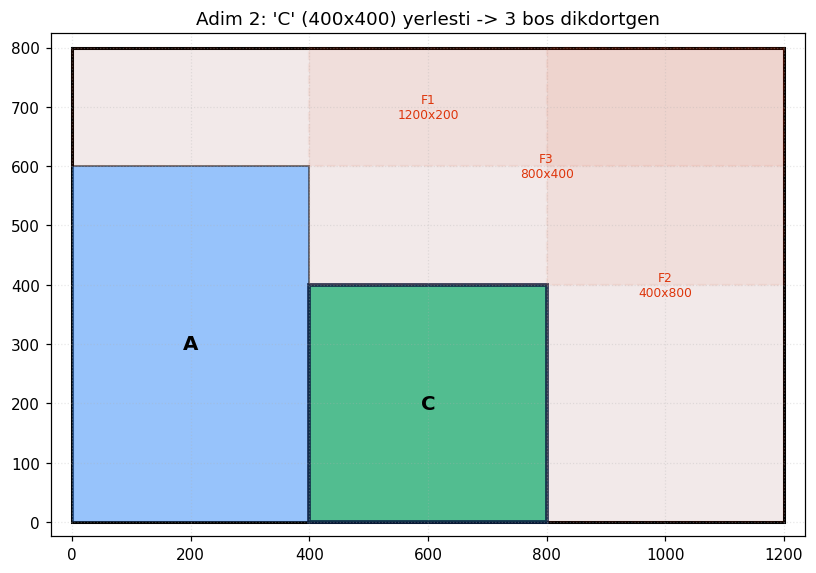
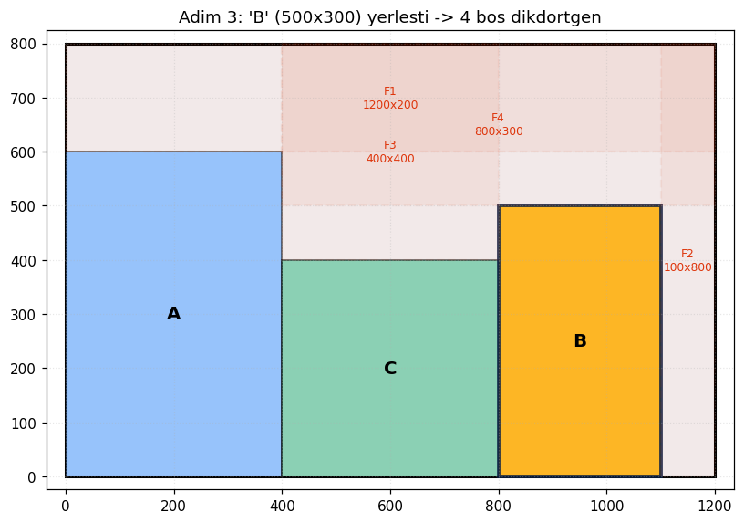
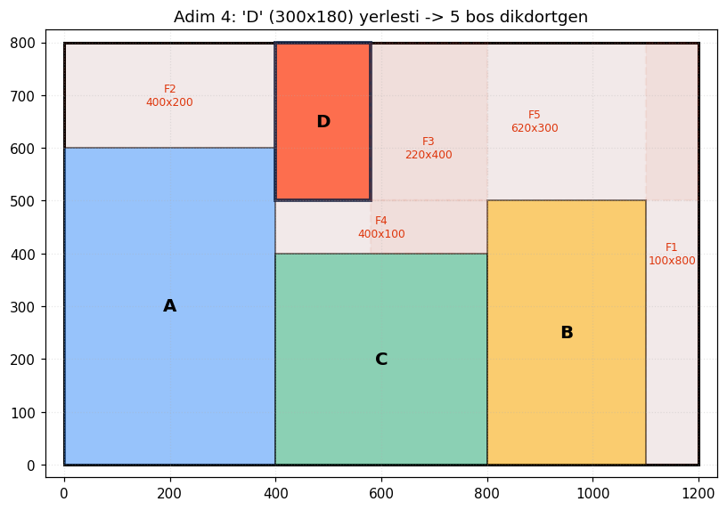
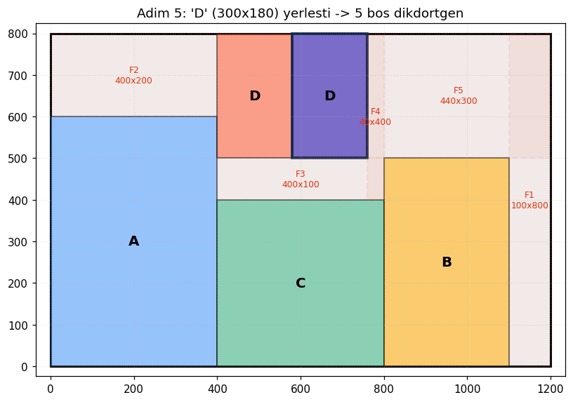

# Optimizasyon Nasil Calisir? — Adim Adim Ornek

Bu dokuman, cam kesim optimizasyonunun nasil calistigini **basit bir
ornek** uzerinden hem adim adim hem de gorsel olarak anlatir.

Buradaki tum gorseller `examples/step_by_step_demo.py` tarafindan,
**uretim cozucusunun birebir ayni mantigi** ile uretilmistir:

```bash
python examples/step_by_step_demo.py
```

---

## 1. Problem Nedir?

Elimizde bir ham cam plakasi ve kesilmesi gereken parcalar var. Amac:
parcalari plakaya oyle yerlestirmek ki **fire (atik) en az** olsun.

Ornegimiz:

| | Genislik | Yukseklik | Adet |
|---|---|---|---|
| **Plaka** | 1200 mm | 800 mm | 1 |
| Parca A | 600 mm | 400 mm | 1 |
| Parca B | 500 mm | 300 mm | 1 |
| Parca C | 400 mm | 400 mm | 1 |
| Parca D | 300 mm | 180 mm | 2 |

Bu, klasik bir **2 boyutlu kesim/paketleme (2D bin packing)** problemidir
ve NP-zor sinifindadir; yani parca sayisi arttikca olasi yerlesim sayisi
patlar. Bu yuzden iki yaklasimi birlestiririz (bkz. Bolum 4).

---

## 2. Katmanli Veri Akisi

```
  JSON girdi
      |
      v
 [ data ]      ----> dogrula (validators)
      |
      v
 [ domain ]    ----> StockSheet, PartOrder modelleri
      |
      v
 [ optimization ] -> MaxRects + CP-SAT (asil is burada)
      |
      v
 [ services ]  ----> maliyet, fire, kesim plani
      |
      v
 [ presentation ] -> konsol raporu + PNG gorsel
```

Her katman bagimsizdir; ornegin gorsellestirmeyi degistirmek cozucuyu
etkilemez.

---

## 3. MaxRects Sezgiseli — Adim Adim

Cozucu, plakayi **bos dikdortgenler (free rectangles)** kumesi olarak
temsil eder. Kirmizi kesikli kutular bos alanlari, `F1, F2...` etiketleri
de bunlarin kimligini gosterir.

Parcalar **buyukten kucuge** (alan) siralanir ve sirayla yerlestirilir.
Her parca icin, en az **kalinti (kisa kenar)** birakan bos dikdortgen
secilir — buna **Best Short Side Fit (BSSF)** denir.

### Adim 0 — Bos plaka

Baslangicta tum plaka tek bir bos dikdortgendir (F1).



### Adim 1 — En buyuk parca (A) yerlesir

A (600x400) en buyuk parcadir, ilk o islenir.

> **Dikkat:** A burada **90° dondurulmus** (400 genis x 600 yuksek)
> olarak yerlesti. Cunku BSSF, dondurulmus halin daha az kalinti
> biraktigini hesapladi:
> - Normal (600x400): kalan kisa kenar = 400 mm
> - Donmus (400x600): kalan kisa kenar = **200 mm** -> secildi
>
> Rotasyon, parcanin `allow_rotation` ozelligi ile kontrol edilir;
> desenli/kaplamali camda `grain: fixed` ile kapatilabilir.



### Adim 2 — C yerlesir, bos alanlar bolunur

C (400x400) yerlestiginde, onunla **kesisen tum bos dikdortgenler**
4 yeni stripe bolunur. Bu, MaxRects'in ayirt edici ozelligidir:
bos alanlar **ust uste binebilir** (orn. F1, F2, F3 cakisir), boylece
sonraki parca icin daha fazla aday konum kalir.



### Adim 3-4 — B ve birinci D yerlesir

Algoritma her parca icin en uygun bos dikdortgeni arayip yerlestirmeye,
sonra bos alanlari guncellemeye devam eder.





### Adim 5 — Son parca (ikinci D) yerlesir

Tum 6 parca (A, B, C, D, D) plakaya sigdi. Geriye kalan kirmizi kesikli
alanlar **fire**dir; `min_offcut_mm` esiginin uzerindekiler "yeniden
kullanilabilir fire" olarak raporlanir.



MaxRects bu tum islemi **milisaniyeler** icinde yapar — binlerce parcali
gercek siparislerde bile saniyenin altinda kalir.

---

## 4. CP-SAT ile Iyilestirme (Hybrid)

MaxRects hizlidir ama "acgozludur" (greedy): her adimda anlik en iyiyi
secer, bu da global optimumu kacirabilir. Iste burada **Google OR-Tools
CP-SAT** devreye girer.

`hybrid` stratejide:

1. **MaxRects** plakanin bir baslangic cozumunu uretir (ms).
2. Bu cozum, CP-SAT'e **ipucu (warm-start / `AddHint`)** olarak verilir.
3. CP-SAT, parcalarin yerlesimini matematiksel kisitlarla
   (`NoOverlap2D`) yeniden modeller ve **MaxRects cozumunden baslayarak**
   iyilestirir.
4. Iki cozumden alan kullanimi yuksek olani secilir.

```
   MaxRects (ms)            CP-SAT polish (saniyeler)
   ~%86 verim      --hint-->  ~%88 verim (daha iyiyse alinir)
```

CP-SAT'i sifirdan calistirmak yerine MaxRects'ten baslatmak, ayni
surede cok daha yuksek kalite verir. Cok buyuk batch'lerde MaxRects
zaten yeterliyse polish atlanabilir (`--polish-time 0`).

### Hangi strateji ne zaman?

| Strateji | Ne zaman |
|---|---|
| `maxrects` | Binlerce parca, hizli sonuc gerektiginde |
| `cpsat` | Kucuk problemler, referans/optimal arayisi |
| `hybrid` | Varsayilan — en iyi kalite/hiz dengesi |

---

## 5. Ciktilar

Optimizasyon bitince uretilenler:

- **Konsol raporu**: verim, maliyet, plaka basina ozet (rich tablolari)
- **`output/report.txt`**: operator icin sirali kesim talimatlari
- **`output/sheet_*.png`**: her plakanin renk kodlu yerlesim gorseli
- **Fire analizi**: yeniden kullanilabilir buyuk parcalarin (offcut)
  konum ve olculeri

---

## Ozet

1. Parcalar buyukten kucuge siralanir.
2. **MaxRects** her parcayi en az kalinti birakan bos dikdortgene koyar,
   bos alanlari boler.
3. **CP-SAT** bu cozumu ipucu alarak matematiksel olarak iyilestirir.
4. Sonuc; rapor, kesim plani ve gorsel olarak sunulur.

Daha fazla detay icin ana [README](../README.md) dosyasina bakin.
